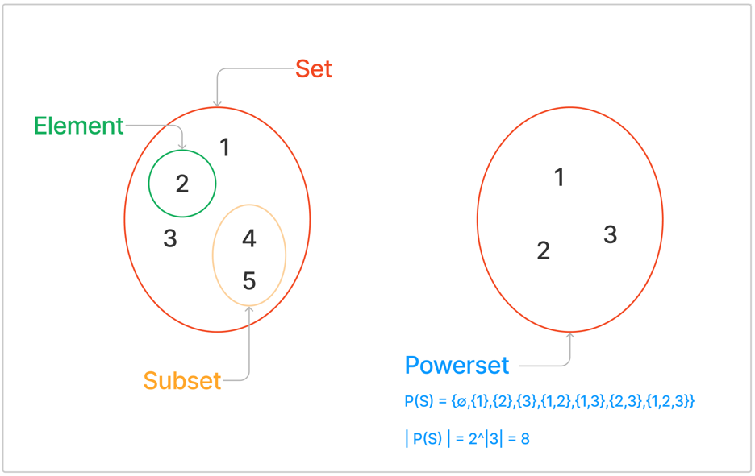

# Set
## What is Set?
In discrete mathematics, a set is a collection of distinct objects, called elements or members, that are considered as a single entity. 
Sets are an important concept in discrete mathematics because they allow us to define and manipulate the structure of collections of objects.  
Sets are typically denoted by enclosing the elements in curly braces, for example: {1, 2, 3, 4}. 
The order of the elements in a set is usually not important, so {1, 2, 3, 4} is considered to be the same set as {4, 3, 2, 1}. 
Some sets can be infinite, for example the set of all natural numbers (1, 2, 3, ...). 
Sets can be used to represent relationships between objects, for example, we can define a set of all the students in a class, or a set of all the countries in the world. Sets are a fundamental concept in mathematics and computer science, and they have many applications in various fields such as computer algorithms, data structures, and programming languages.

### Element of set (∈)
As mentioned above sentence, element is a member of a set. It is a specific object that belongs to a set.
For example, in the set {1, 2, 3, 4}, the elements are 1, 2, 3, and 4.
In Discrete mathematics, element can be denote as ∈. ∈ ---> Element

### Cardinality
Cardinality is the number of elements contained in Set. 
In Discrete mathematics, cardinality can be denoted as |S|. 
For example, if S = {1, 2, 3, 4, 5}, then cardinality of S is 5. In other words, |S| = 5. 
※note  
if S is empty, then cardinality is 0. 

### Subset
a subset is a collection of objects (elements) that are chosen from a larger set.  
For example, if we have a set A which contains the elements 1, 2, and 3, then the set {1, 2} is a subset of A.  
The symbol used to represent that a set is a subset of another set is ⊆.  
So, we can write {1, 2} ⊆ A to indicate that {1, 2} is a subset of A. 

※note 
Empty set is a subset of any set(∅ ⊆ S) 

### Powerset
Powerset is the set which containing all the subset of S, it can be denoted as P(S).
Example :
Given a set S = {1,2,3} 
the powerset is P(S) = {∅,{1},{2},{3},{1,2},{1,3},{2,3},{1,2,3}} 
thus powerset containing all subset of S. 

#### Cardinality of powerset
cardinality of powerset can be calculated by following formula: 
| P(S) | = 2^|S|  

Example :  
S={1,2,3}.    |S| = 3 
P(S) = {∅,{1},{2},{3},{1,2},{1,3},{2,3},{1,2,3}} 
| P(S) | = 8 = 23 = 2^|S| 

## Set operations
### Union (A U B)
The union of two sets is a new set that contains all the elements from both of the original sets A and B. 
Symbolically, if A and B are sets, then the union of A and B is denoted as A ∪ B and is defined as the set of all elements that belong to either A or B, or to both.
For example, if A = {1, 3, 4, 5} and B = {1, 2, 3}, then A ∪ B = {1, 2, 3, 4, 5}. 

■Formula 
A U B = {x | x ∈ A or x ∈ B}

### Intersection (A ∩ B)
The intersection of two sets is a new set that contains only the elements that are common to both of the original sets. 
Symbolically, if A and B are sets, then the intersection of A and B is denoted as A ∩ B and is defined as the set of all elements that belong to both A and B. 
For example, if A = {1, 3, 4, 5} and B = {1, 2, 3}, then A ∩ B = {1, 3}. 

■Formula 
A ∩ B = { x | x ∈ A and x ∈ B } 

### Set difference(A - B)
The set difference in discrete mathematics is that given two sets A and B, all element A, but not in B. 
For example, if A = {1, 2, 3} and B = {2, 3, 4}, then A - B = {1}. 

■Formula 
A - B = { x | x ∈ A and x ∉ B }

### Symmetric difference (A ⊕ B )
Given two sets A and B, the symmetric difference is containing all element A and B but not both.  
For example, if A = {1, 2, 3} and B = {2, 3, 4, 5}, then A ⊕ B = {1, 4, 5}. 

■Formula 
A ⊕ B = { x | (x ∈ A or x ∈ B) and x ∉ A ∩ B}
A ⊕ B = (A U B) – (A ∩ B)

